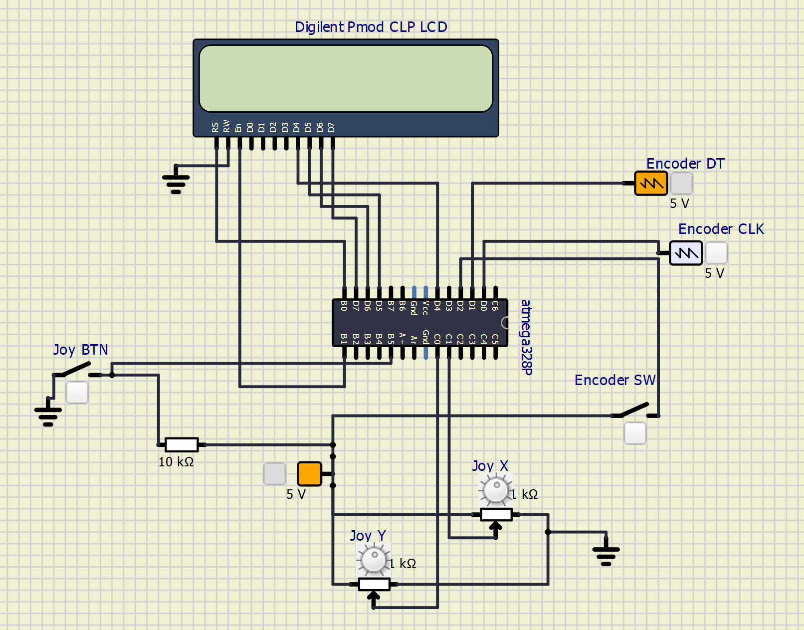
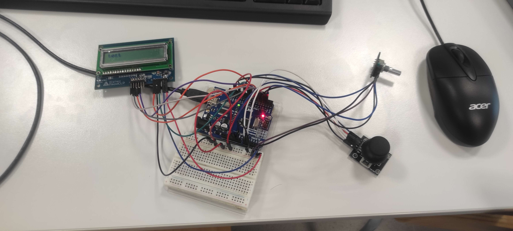
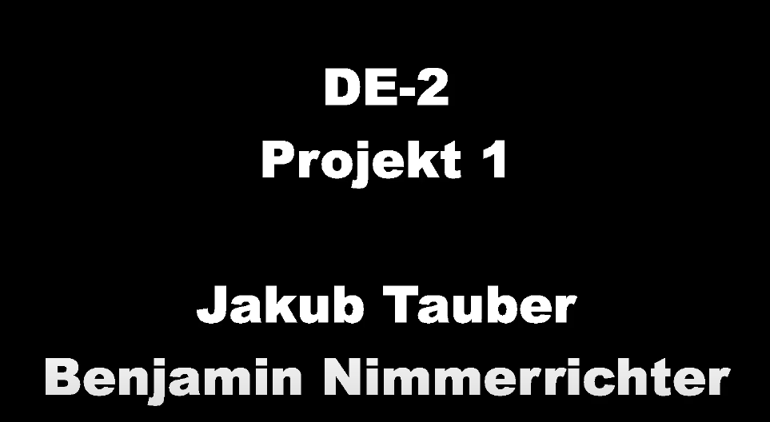

# Kontrola displeje pomocí joy-sticku a rotačního enkodéru


### Team members

* Benjamin Nimmerrichter (responsible for programing and video making)
* Jakub Tauber (responsible for programing and documentation)
## Úvod
V projektu jsme měli za úkol použí lcd displej, joy-stick a rotační enkoder. Vytvořili jsme program, který nám vypisuje na displej pohyby a sepnutí joy-sticku a enkoderu.
### Popis funkce
#### Joy-stick
* pootočení joy-sticku doprava => na displeji se zobrazí (Joy:Right)
* pootočení joy-sticku doleva => na displeji se zobrazí (Joy:Left)
* pootočení joy-sticku směrem vzhůru => na displeji se zobrazí (Joy:Up)
* pootočení joy-sticku směrem dolů => na displeji se zobrazí (Joy:Down)
* stisktuní tlačítka joy-sticku => na displeji se zobrazí (JB:On)
#### Enkodér
* pootočení enkoderu ve směru hodinových ručiček => na displeji se zobrazí (Dir:CW)
* pootočení enkoderu v protisměru hodinových ručiček => na displeji se zobrazí (Dir:CC)
* stisktuní tlačítka enkoderu => na displeji se zobrazí (EB:On)
## Obsah 
* [Hardware description](#hardware)
* [Software description](#software)
* [Video](#video)
* [References](#ref)
<a name="hardware"></a>
## Hardware description
### Schema zapojení

#### Popis ovládacích prvků
- Joy BTN - tlačítko na joy-sticku. Na displeji se zobrazí JB:(On/Off)
- Joy Y - ovládání joy-sticku po ose y. Na disleji se zobrazí (Up-Down)
- Joy X - ovládání joy-sticku po ose x. Na disleji se zobrazí (Left-Right)
- Encoder DT a Encoder CLK - simulace otočení enkodéru. Na displeji se zobrazí CW (Clockwise - rotace ve směru hodinových ručiček) nebo CC (Counter Clockwise - rotace protisměru hodinových ručiček)
- Encoder SW - tlačitko na enkodéru. Na displeji se zobrazí EB:(On/Off)
### Rozložení pinů na desce (Arduino UNO)


### Reálné zapojení obvodu ve cvičení



<a name="software"></a>
## Software description
### Hlavní soubor (main.c)
Import všech potřebných knihoven a definování proměnných.
 ```c
 #ifndef F_CPU
#define F_CPU 16000000 // CPU frequency in Hz required for delay funcs
#endif

/* Includes ----------------------------------------------------------*/
#include <avr/io.h>     // AVR device-specific IO definitions
#include <util/delay.h> // Functions for busy-wait delay loops
#include <timer.h> 
#include <uart.h>
#include <gpio.h>
#include <avr/interrupt.h>
#include <stdlib.h> 
#include <lcd.h>            // Peter Fleury's LCD library
// -----
// This part is needed to use Arduino functions but also physical pin
// names. We are using Arduino-style just to simplify the first lab.
#define BTN 5    //PB5
#define X 0      //PC0
#define Y 1      //PC1

#define OFFSET 50
// -----
uint16_t xy_val[2]= {0,0};
uint8_t x_conv=0;
uint8_t call =0;

uint8_t btn_val1 = 0;
uint8_t ovfs = 0;
char str[4];


#define outputCLK 0
#define outputDT 1
#define outputSW 2

static uint8_t change = 0;
static uint8_t cycles = 0; 
static uint8_t counter = 0; 
static uint8_t aState;
static uint8_t aLastState = 0;
static uint8_t btn_val2 = 1; 
```
```c


int main(void)
{
  TIM1_overflow_interrupt_enable();
  TIM1_overflow_33ms(); //set to 33ms when testing on real hardware
  TIM2_overflow_interrupt_enable();
  TIM2_overflow_16ms();
  sei();

  //uart_init(UART_BAUD_SELECT(9600, F_CPU));
  GPIO_mode_input_pullup(&DDRB,BTN);

  lcd_init(LCD_DISP_ON);
  //ADMUX |= (1<<REFS1); ADMUX |= (1<<REFS0);
  ADMUX &= ~(1<<REFS1); ADMUX &= ~(1<<REFS0);
  // Select input channel ADC0 (voltage divider pin)
  
  // Enable ADC module
  ADCSRA |= (1<<ADEN);
  // Enable conversion complete interrupt
  ADCSRA |= (1<<ADIE);

  
  GPIO_mode_input_nopull(&DDRD,outputCLK); 
  GPIO_mode_input_nopull(&DDRD,outputDT); 
  GPIO_mode_input_nopull(&DDRB,outputSW);

  //aLastState = GPIO_read(&PIND,outputCLK);

    while(1)
    {

      

      if (call == 1) //call for the main processing
      {
        lcd_clrscr();
        btn_val1 = GPIO_read(&PINB,BTN);
        btn_val2 = GPIO_read(&PIND,outputSW);

        //uart_puts("\r\nPosition: ");
        
        //joystick button
        lcd_gotoxy(0,0);
        lcd_puts("JB:");
        if (btn_val1 != 1)
        lcd_puts("On");
        else
        lcd_puts("Off");

        //encoder button
        lcd_gotoxy(9,0);
        lcd_puts("EB:");
        if (btn_val2 == 1)
        lcd_puts("On");
        else
        lcd_puts("Off");


        //joystick postition
        lcd_gotoxy(0,1);
        lcd_puts("Joy:");
      
        if (xy_val[0] >= 800)
        {
      
          lcd_puts("Lef");
          
          //uart_puts("Left \r\n");
        }
        else if (xy_val[0] <= 300)
        {
         
          lcd_puts("Rig");
          //uart_puts("Right \r\n");
        }
        else if (xy_val[1] >= 800)
        {
         
        lcd_puts("Up");
          //uart_puts("Down\r\n");
        }
        else if (xy_val[1] <= 300)
        {
        
          lcd_puts("Dow");
          //uart_puts("Up\r\n");
        }
        else
        {
          lcd_puts("Cen");
          //uart_puts("Center \r\n");
        }

        //encoder
        lcd_gotoxy(9,1);
        lcd_puts("Dir:");
        //cw when clk != dt; cc when clk = dt

          if (cycles < 5)
          {
            if (counter==1)
            lcd_puts("CW");
            else
            lcd_puts("CC");
          }


        if (change == 0)
          cycles ++;
        else
          cycles = 0;

        change = 0;

        
      }
      call = 0;


    }
    return 0;
}

  ISR(TIMER1_OVF_vect)
  {
    ADCSRA |= (1<<ADSC);
    


    if (ovfs == 0){
    //for X
    x_conv=1;
    ADMUX &= ~((1<<MUX0) | (1<<MUX1) | (1<<MUX2) | (1<<MUX3));
    
    ovfs++;
    }
    else
    {
      //for y
      x_conv=0;
      ADMUX &= ~( (1<<MUX1) | (1<<MUX2) | (1<<MUX3)); ADMUX |= (1<<MUX0);
      

      ovfs = 0;
    }
    call = 1;    
  }

  ISR(TIMER2_OVF_vect)
  {
    
   
    aState = GPIO_read(&PIND,outputCLK);
    if (aState != aLastState && aState == 1)
    {
      change=1;
      if (GPIO_read(&PIND,outputDT) == 1)
      {
        counter=1;
      }
      else 
      {
        counter=0;
      }
    }
    aLastState = aState; 
  }

  ISR(ADC_vect)
  {
    if (x_conv == 0)
    {
      xy_val[0] = ADC;
    }
    else
    {
      xy_val[1] = ADC;
    }
  }
 ```
 ### Doplňkové moduly
 * [timer](https://github.com/xtaube00/Digital-electronics-2/tree/main/labs/projekt1/include)
 * [gpio](https://github.com/xtaube00/Digital-electronics-2/tree/main/labs/projekt1/lib/gpio)
 * [lcd](https://github.com/xtaube00/Digital-electronics-2/tree/main/labs/projekt1/lib/lcd)
 * [uart](https://github.com/xtaube00/Digital-electronics-2/tree/main/labs/projekt1/lib/uart)
 * [soubory ze simulačního programu](https://github.com/xtaube00/Digital-electronics-2/tree/main/labs/projekt1/soubory%20ze%20simula%C4%8Dn%C3%ADho%20programu)

<a name="video"></a>
## Video

[](https://www.youtube.com/watch?v=gr591NwyTGU)

<a name="ref"></a>
## References

1. [https://www.electronicshub.org/arduino-uno-pinout/]
2. [https://lastminuteengineers.com/rotary-encoder-arduino-tutorial/]
3. [https://exploreembedded.com/wiki/Analog_JoyStick_with_Arduino]
4. [https://digilent.com/reference/pmod/pmodcls/reference-manual?redirect=1]

