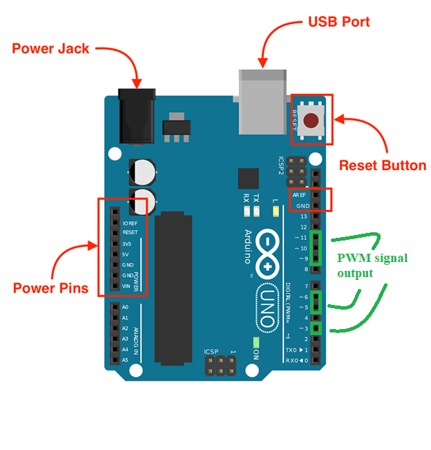
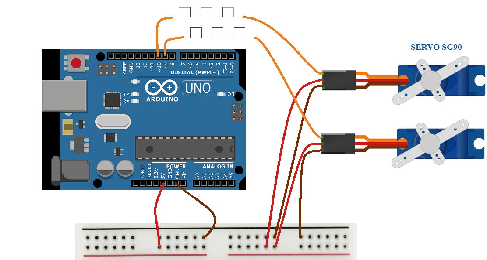
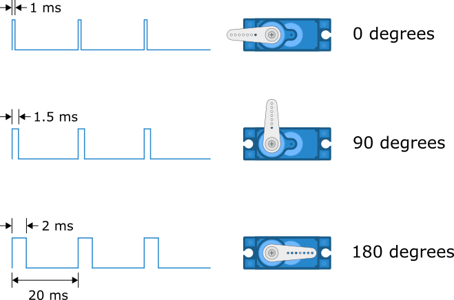
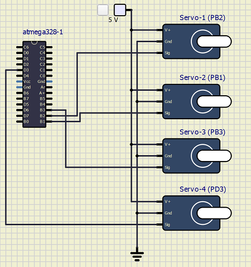
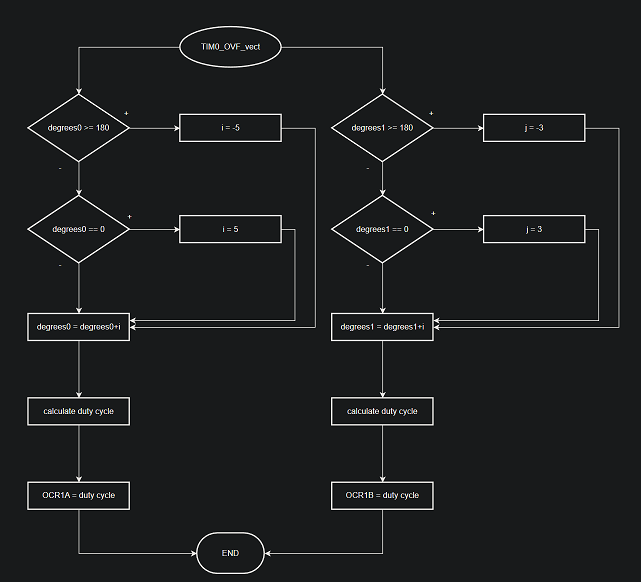
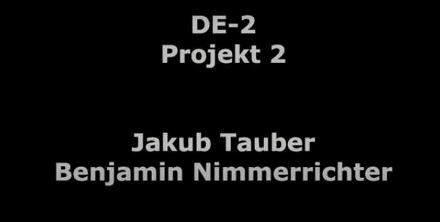

# Projekt 2

## Zadání
Generování několika PWM kanálů. Použití dvou (nebo více) servomotorů SG90.
<a name="github"></a>

## Struktura Github repozitáře

   ```c
   Projekt 2            // PlatfomIO project
   ├── include  
       └── timer.h
   ├── lib 
   ├── obrazky
   ├── pio
   ├── src              // Source file
   │   └── main.c
   ├── test
   ├── vscode
   │     
   └── platformio.ini   // Project Configuration File
   └── readme.md        // Report of this project
   └── simulace2.simu
   ```

### Obsah
* [Struktura Github repozitáře](#github)
* [Hardware](#hardware)
* [Software](#software)
* [Video](#video)
* [References](#zdroje)

<a name="github"></a>

### Členové týmu

* Benjamin Nimmerrichter (programování servo motorů, tvorba videa, simulace, vývojový diagram)
* Jakub Tauber (programování servo motorů, dokumentace, tvorba schéma)
<a name="hardware"></a>

## Úvod projektu
Tento projekt vytváří 4 nezávislé PWM signály pro ovládání servomotorů. Projekt je napsán v jazyce C a většina programu je realizovaná pomocí nastavování registrů na mikrokontroleru Atmega328P. Hlavní smyčka programu je prázdná, pro nastavování veličin se používá obsluha přerušení ISR časovače Timer/Counter0. Výsledná realizace využívá 8 Bytů RAM a 1416 Bytů flash paměti."
## Hardware 
### Výstupy pro použítí PWM 

### Reálné schéma zapojení


| **Servo motor** | **Popis konektorů** | **Označení** |
| :-: | :-: | :-: |
| PWM | PWM signál |  |
| VCC | Napájení (+5V) |  |
| GND | Napájení (zem) |  |


<a name="software"></a>
## Software description

Pro vytvoření ovládacího signálu pro řízení servo motorů jsme použili registry TCCR1A a TCCR1B v režimu **Fast PWM** 
* TCCR1A – Timer/Counter1 Control Register A:

| **Bit** | 7 | 6 | 5 | 4 | 3 | 2 | 1 | 0 |
| :-: | :-: | :-: | :-: | :-: | :-: | :-: | :-: | :-: |
| **(0x80)** | COM1A1 | COM1A0 | COM1B1 | COM1B0 | - | - | WGM11 | WGM10 |
| **Read/Write** | R/W | R/W | R/W | R/W | R | R | R/W | R/W |
| **Value** | 1 | 0 | 1 | 0 | 0 | 0 | 1 | 0 |
| **Description** | Compare Outuput Mode for Channel A  | Compare Outuput Mode for Channel A  | Compare Outuput Mode for Channel B | Compare Outuput Mode for Channel B | - | - | Waveform Generation Mode | Waveform Generation Mode |

* Výstupní režim registru TCCR1A (Fast PWM)

| COM1A1/COM1B1 | COM1A0/COM1B0 | Description 
| :-: | :-: | :-: |
| 0 | 0 | Normal port operation, OC1A/OC1B disconnected | 
| 0 | 1 | WGM13:0 = 14 or 15: Toggle OC1A on compare match, OC1B disconnected (normal port operation). For all other WGM1 settings, normal port operation |
| 1 | 0 | Clear OC1A/OC1B on compare match, set OC1A/OC1B at BOTTOM (non-inverting mode) | 
| 1 | 1 | Set OC1A/OC1B on compare match, clear OC1A/OC1B at BOTTOM (inverting mode) |

* TCCR1B – Timer/Counter1 Control Register B:

| **Bit** | 7 | 6 | 5 | 4 | 3 | 2 | 1 | 0 |
| :-: | :-: | :-: | :-: | :-: | :-: | :-: | :-: | :-: |
| **(0x81)** | ICNC1 | ICES1 | - | WGM13 | WGM12 | CS12 | CS11 | CS10 |
| **Read/Write** | R/W | R/W | R | R/W | R/W | R/W | R/W | R/W |
| **Value** | 0 | 0 | 0 | 1 | 0 | 0 | 1 | 0 |
| **Description** | Input Capture Noise Canceler |  Input Capture Edge Select | Reserved bit | Waveform Generation Mode | Waveform Generation Mode | Clock Select | Clock Select | Clock Select |

### Řízení servomotoru
* Servomotor je řízen vysíláním série impulsů. 
* Frekvence řídicího signálu by měla být 50 Hz nebo by měl nastat impuls každých 20 ms. 
* Šířka impulsu určuje úhlovou polohu serva a tyto typy serv se obvykle mohou otáčet o 180 stupňů.

| **Doba trvání pulzu** | 1ms | 1,5ms | 2ms 
| :-: | :-: | :-: | :-: |
| **Otočení serva** |  0° | 90° | 180° |




### Seznam zdrojových souborů
* [main.c](https://github.com/xtaube00/Digital-electronics-2/blob/main/labs/projekt2/src/main.c)
* [timer.h](https://github.com/xtaube00/Digital-electronics-2/blob/main/labs/projekt2/include/timer.h)
### Schéma zapojení v simulačním programu

* [simulace zde](https://github.com/xtaube00/Digital-electronics-2/blob/main/labs/projekt2/simulace2.simu)
### Vývojový diagram



<a name="video"></a>
## Video
[](https://www.youtube.com/watch?v=E9tIq9824uA)

<a name="zdroje"></a>

## Zdroje

1. [Servo motor](https://howtomechatronics.com/how-it-works/how-servo-motors-work-how-to-control-servos-using-arduino/)
2. [ATmega328P Datasheet](https://ww1.microchip.com/downloads/en/DeviceDoc/Atmel-7810-Automotive-Microcontrollers-ATmega328P_Datasheet.pdf)
3. [Obrázek otočení servo motoru](https://www.makerguides.com/servo-arduino-tutorial/)
